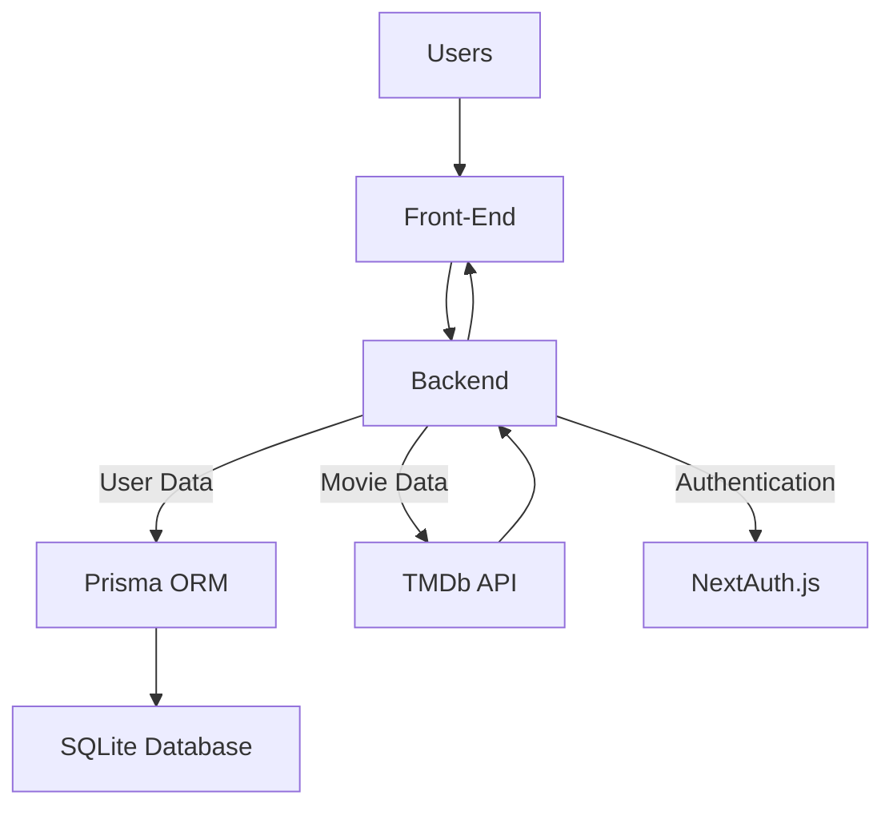

# Cinemify - Your Cinema Journey Starts Here

Cinemify is your one-stop destination for the ultimate movie experience, right from discovery to reviews and trailers. With a rich, user-friendly interface powered by Next.js and TypeScript, we make movie exploration seamless and fun. Dive into detailed information about films, craft insightful reviews, and get a sneak peek with high-quality trailers. Whether you're a casual viewer or a cinephile, Cinemify offers something for everyone.

## Table of Contents
- [Core App Features](#core-app-features)
- [Technology Stack](#technology-stack)
- [App Architecture](#app-architecture)
- [Getting Started](#getting-started)
- [License](#license)

## Core App Features

- `Search Functionality`: Search for movies by title, director, actor, or genre.
- `Recommendations`: Get personalized movie recommendations based on your watch history and preferences.
- `Trending Movies`: Stay up-to-date with the most popular movies right now.
- `User Ratings`: Rate movies on a scale of 1 to 10.
- `Write Reviews`: Share your thoughts on a movie with a detailed review.
- `Watch Trailers`: Enjoy high-quality trailers directly within the app.
- `Sign-up/Login`: Register an account and log in securely.
- `Profile Customization`: Add a profile picture, set a bio, and list your favorite genres and movies.

## Technology Stack

This blend of technologies ensures that Cinemify is built on a modern, efficient, and reliable stack, which aids both in development and the final user experience.

#### Web Framework
- `Next.js`: Utilized for both server-side and client-side rendering, Next.js enables a fast and SEO-friendly user experience.

#### Development Language
- `TypeScript`: Adopted for both front-end and back-end development, TypeScript offers strong type-checking to catch errors during development, leading to robust and maintainable code.
Styling
- `SCSS`: SCSS is used for styling the front-end, allowing for variables, nesting, and other features that make the CSS both more maintainable and extendable.

#### Database
- `Prisma`: Used as the ORM for interacting with the database, Prisma simplifies database workflows with a strongly-typed API.
- `SQLite`: A lightweight, file-based database ideal for development and smaller-scale applications.

#### API Communication
- `RESTful API`: The back-end communicates with the front-end using REST API endpoints, facilitating seamless data exchange.
- `TMDb API`: The app leverages the TMDb API to source accurate and extensive movie data.

#### Authentication
- `NextAuth.js`: This library is used for implementing secure authentication workflows with various OAuth providers and other custom strategies.

## App Architecture



## Getting Started

First, run the development server:

```bash
npm run dev
# or
yarn dev
# or
pnpm dev
# or
bun dev
```

Open [http://localhost:3000](http://localhost:3000) with your browser to see the result.

You can start editing the page by modifying `app/page.tsx`. The page auto-updates as you edit the file.

This project uses [`next/font`](https://nextjs.org/docs/basic-features/font-optimization) to automatically optimize and load Inter, a custom Google Font.

## License
[MIT](https://github.com/javier-arango/cinemify/blob/main/LICENSE)
