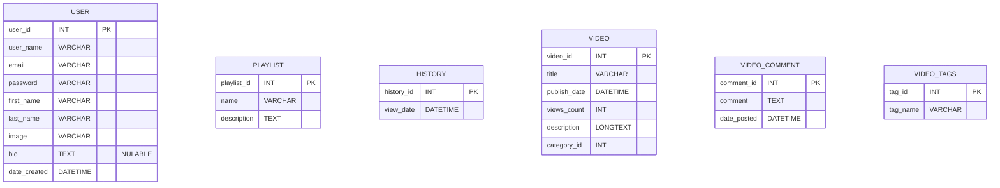
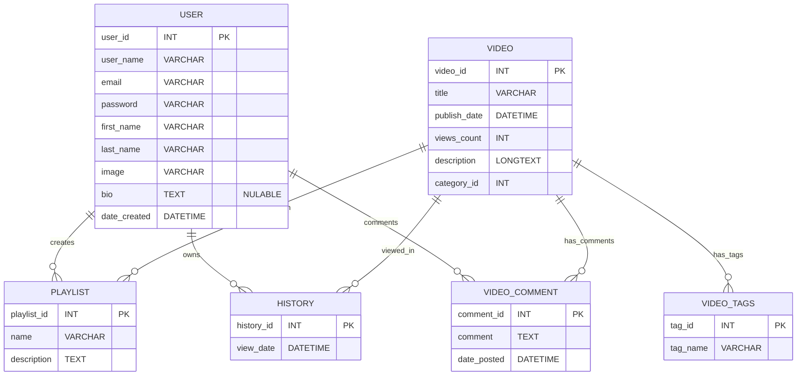

<p align="center">
    <picture>
      <source media="(prefers-color-scheme: dark)" srcset="https://github.com/javier-arango/codeflix/assets/58098790/9a05bbbb-de7d-4a09-8ffa-58f970054211">
      
    </picture>
</p>


<h3 align="center">Fuel Your Code. Spark Your Journey.</h3>

<br/>
<p align="center">Codeflix is your one-stop educational platform designed exclusively for computer science students. Whether you're delving into algorithms, exploring backend development, or learning front-end frameworks, Codeflix offers an expansive collection of curated educational videos to guide your journey. With features that allow users to categorize videos, create personalized playlists, and dive deeper into specific topics, we're here to accelerate your learning process and elevate your coding skills.</p>

## Table of Contents
- [Core App Features](#core-app-features)
- [Technology Stack](#technology-stack)
  - [Web Framework](#web-framework)
  - [Development Language](#development-language)
  - [Database](#database)
  - [API Communication](#api-communication)
  - [Authentication](#authentication)
- [App Architecture](#app-architecture)
- [Database Design](#database-design)
  - [Database Tables](#database-tables)
  - [Database Schema](#database-schema)
- [Getting Started](#getting-started)
    - [Development Server](#development-server)
    - [Database Setup with Prisma](#database-setup-with-prisma)
      - [Migration](#migration)
      - [Manual Seeding](#manual-seeding)
      - [Visualize the Database](#visualize-the-database)
- [License](#license)

## Core App Features

- `Search Functionality`: Users can search for educational videos by topic, difficulty level, or instructor.
- `Category Browsing`: Navigate through pre-defined categories such as Backend, Frontend, Algorithms, and more.
- `Trending Videos`: Keep tabs on the most popular and highly-rated educational videos in the computer science realm.
- `User Ratings`: Rate videos on a scale of 1 to 5 to help improve content quality and recommendations.
- `Write Reviews`: Share your insights on a particular video or topic by writing a detailed review.
- `Custom Playlists`: Create, edit, and manage personalized playlists of videos for streamlined learning.
- `In-Video Features`: Utilize options like adjustable playback speed, closed captions, and in-video note-taking.
- `Sign-up/Login`: Securely register and log into your account with email verification and two-factor authentication.
- `Profile Customization`: Customize your user profile with a photo, short bio, and your areas of interest in computer science.
- `Supplementary Resources`: Access additional reading material, code samples, and quizzes related to each video topic.

## Technology Stack

This blend of technologies ensures that Cinemify is built on a modern, efficient, and reliable stack, which aids both in development and the final user experience.

#### Web Framework
- `Next.js`: Utilized for both server-side and client-side rendering, Next.js enables a fast and SEO-friendly user experience.
- `React.js`: Primarily used for building user interfaces, React.js allows for efficient and dynamic rendering of UI components.

#### Development Language
- `TypeScript`: Adopted for both front-end and back-end development, TypeScript offers strong type-checking to catch errors during development, leading to robust and maintainable code.
- `SCSS`: SCSS is used for styling the front-end, allowing for variables, nesting, and other features that make the CSS both more maintainable and extendable.

#### Database
- `Prisma`: Used as the ORM for interacting with the database, Prisma simplifies database workflows with a strongly-typed API.
- `SQLite`: A lightweight, file-based database ideal for development and smaller-scale applications.

#### API Communication
- `RESTful API`: The back-end communicates with the front-end using REST API endpoints, facilitating seamless data exchange.
- `Couldinary API`: This cloud-based image and video management platform is used for storing and serving user-uploaded images.

#### Authentication
- `NextAuth.js`: This library is used for implementing secure authentication workflows with various OAuth providers and other custom strategies.

## App Architecture


## Database Design
Database design is a crucial component of any application, as it ensures that the data is stored in a logical and efficient manner. The database design for Cinemify is based on the following ER diagram and schema.

### Database Tables
Database tables are the building blocks of any database, and they are used to store data in a structured format. The following tables are used in Cinemify.



### Database Schema
Database schema is the skeleton structure that represents the logical view of the entire database. The following schema is used in Cinemify.




## Getting Started

### Development Server
First, run the development server:

```bash
npm run dev
# or
yarn dev
# or
pnpm dev
# or
bun dev
```

Open [http://localhost:3000](http://localhost:3000) with your browser to see the result.

You can start editing the page by modifying `app/page.tsx`. The page auto-updates as you edit the file.

This project uses [`next/font`](https://nextjs.org/docs/basic-features/font-optimization) to automatically optimize and load Inter, a custom Google Font.

### Database Setup with Prisma

This project is configured with Prisma, an advanced Object-Relational Mapping (ORM) to facilitate seamless database operations. Follow the steps below for both development and testing environments.

#### Migration

Run the migration command to establish the database schema. Prisma Migrate uses your migration files to manage the schema changes:

```bash
npm run prisma:migrate
# or
yarn prisma:migrate
```

> **Note:** Prisma Migrate integrates with seeds. When it resets the development database, it automatically triggers the seeding.

#### Manual Seeding

Execute the seeding command to populate your database with predefined data essential for testing. Modify the `prisma/seed.ts` file if you wish to make changes to the default seeding data:

```bash
npm run prisma:seed
# or
yarn prisma:seed
```

#### Visualize the Database

Prisma Studio provides a graphical interface, enabling you to visualize and manage your database records effortlessly. You can run the following command to start Prisma Studio:

```bash
npm run prisma:studio
# or
yarn prisma:studio
```

Visit [http://localhost:5555](http://localhost:5555/) to access Prisma Studio and manage your database interactively.


## License
[MIT](https://github.com/javier-arango/cinemify/blob/main/LICENSE)
